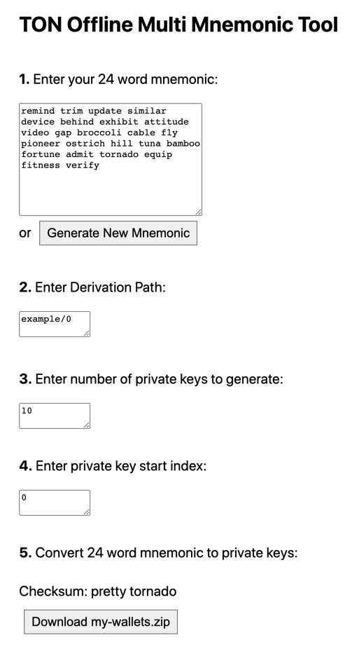

# TON Offline Multi Mnemonic Code Converter
Use single mnemonic to create multiple pks.

For security reasons the mnemonic should be stored in cold wallet.
This tool enables the user to store only one mnemonic and create multiple pks from this mnemonic,
which facilitates the management of the cold storage.

Using the stored mnemonic the user can create the same pks if needed.

This tool uses tonweb-mnemonic to convert the mnemonic to multiple seeds by using hash function (SHA-512) to sign mnemonic key with an incremented number (starting with 0) as a password for each pk.

### How to use
1. Download and copy this library to a secured computer (preferably without internet connection)
2. Open ton-mnemonic-pk.html
3. Enter 24 word mnemonic or use the 'Generate New Mnemonic' button
4. Enter derivation path. Different derivation paths will generate different private keys
5. Enter number of private keys to generate and pk start index. Can be useful if you want to generate more pks
6. Covert the mnemonic to pks and download zip files
7. The 2-checksum words can be stored and used later to validate the mnemonic you entered is correct

#### Examples:
Generate 10 pks starting from index 0 with a given mnemonic:
- mnemonic: "remind trim update similar device behind exhibit attitude video gap broccoli cable fly pioneer ostrich hill tuna bamboo fortune admit tornado equip fitness verify"  
- derivation path: example/0  
- number of private keys: 10  
- start index: 0  

If you want to generate 5 more pks using the same mnemonic and the same derivation path you can do the following:
- mnemonic: "remind trim update similar device behind exhibit attitude video gap broccoli cable fly pioneer ostrich hill tuna bamboo fortune admit tornado equip fitness verify"  
- derivation path: example/0  
- number of private keys: 5  
- start index: 10  

If you want to use the same mnemonic and generate 10 different pks starting from index 0, use different derivation path:
- mnemonic: "remind trim update similar device behind exhibit attitude video gap broccoli cable fly pioneer ostrich hill tuna bamboo fortune admit tornado equip fitness verify"  
- derivation path: example/1  
- number of private keys: 10  
- start index: 0  

 

